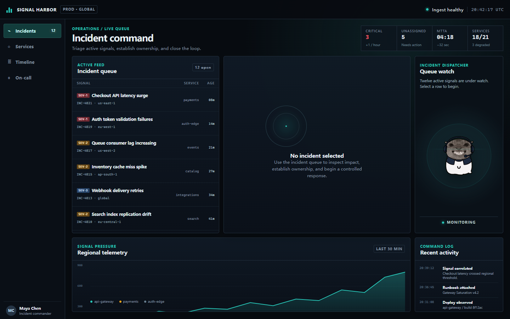
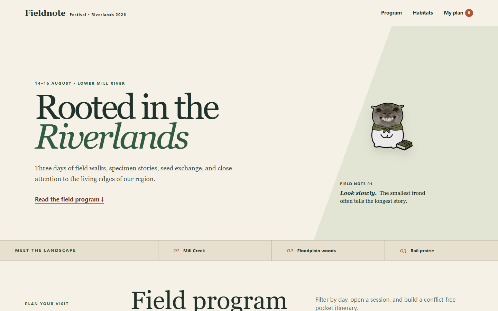
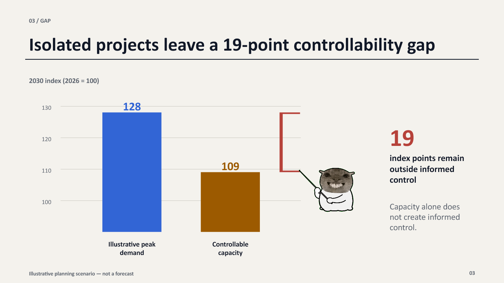
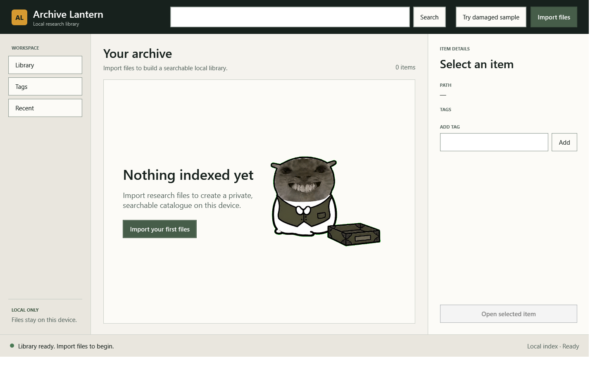
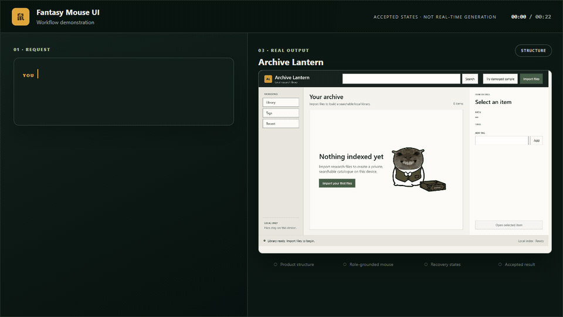

# Fantasy Mouse UI

Design product-specific SaaS, websites, presentations, and desktop software with one visually grounded mouse character — without forcing every product into one template.

```powershell
codex plugin add fantasy-mouse-ui@fantasy-mouse-ui --json
```

## Real results

| | |
| --- | --- |
| [](examples/signal-harbor/README.md)<br>**Signal Harbor · SaaS Dashboard**<br>A dense dark incident console built around triage, assignment, recovery, and resolution. | [](examples/fieldnote-festival/README.md)<br>**Fieldnote Festival · Website**<br>An editorial field-program site with schedule conflicts, saved plans, and responsive mobile recovery. |
| [](examples/grid-forward-2030/README.md)<br>**Grid Forward 2030 · Presentation**<br>An editable decision deck where the character presents one specific data gap instead of decorating every slide. | [](examples/archive-lantern/README.md)<br>**Archive Lantern · Desktop Software**<br>A native WPF research library with import, indexing, tagging, search, failure recovery, and duplicate preservation. |

[](docs/assets/archive-lantern-demo.mp4)

*Workflow demonstration assembled from accepted Archive Lantern states; it is not a recording or speed claim of real-time model generation.*

## Quick Start

Ask normally and name a mode. The Agent states the selected mode and reason first, verifies the bundled visual authorities, then produces editable output and checks it in the real target surface.

| Mode | Best for | Required depth |
| --- | --- | --- |
| **Fast** | One bounded, low-risk screen or revision | Inspect source, ground the character, edit, render/open, and run focused visual/hand QA. |
| **Standard** | Most product UI and multi-state feature work | Add a workflow brief, key states, direction confirmation when needed, behavior checks, and a concise handoff. This is the default. |
| **Strict** | Public benchmarks, multi-page systems, permissions, finance/medical/destructive flows, and releases | Run the complete workflow, recovery/accessibility checks, same-context comparisons, provenance, and evidence gates. Strict triggers cannot be downgraded. |

### Fast example prompt / Fast 示例 Prompt

```text
Mode / 模式: Fast
State the selected Mode and reason first. / 请先说明所选模式和原因。
Redesign one low-risk website hero for a neighbourhood bakery. Keep the existing copy and brand colours, return editable source, open the real page, and check the final render at desktop and mobile widths.
为一家社区面包店重新设计一个低风险的网站首屏。保留现有文案和品牌色，交付可编辑源码，真实打开页面，并检查桌面与手机宽度下的最终渲染。
```

### Standard example prompt / Standard 示例 Prompt

```text
Mode / 模式: Standard
State the selected Mode and reason first. / 请先说明所选模式和原因。
Design a Windows desktop research library like Archive Lantern. Cover empty library → import → indexing → indexed → tag → search → open result, plus the key failed-import and no-results states. Build editable UI and verify the primary journey in the real runtime.
设计一个类似 Archive Lantern 的 Windows 桌面研究资料库。覆盖空资料库 → 导入 → 索引 → 已索引 → 标签 → 搜索 → 打开结果，并补充导入失败和无结果关键状态。构建可编辑 UI，并在真实运行环境验证主流程。
```

### Strict example prompt / Strict 示例 Prompt

```text
Mode / 模式: Strict
State the selected Mode and reason first. / 请先说明所选模式和原因。
Build a SaaS incident dashboard with role permissions, assignment and resolution failures, safe retry, keyboard navigation, contrast checks, same-context character comparison, screenshots, and a complete acceptance record. Treat this as a public benchmark.
构建一个 SaaS 事故响应看板，包含角色权限、分派与解决失败、安全重试、键盘导航、对比度检查、同场景角色对比、截图和完整验收记录。把它作为公开 benchmark 执行。
```

Explore the complete accepted cases:

- [Signal Harbor — SaaS dashboard](examples/signal-harbor/README.md)
- [Fieldnote Festival — website](examples/fieldnote-festival/README.md)
- [Grid Forward 2030 — presentation](examples/grid-forward-2030/README.md)
- [Archive Lantern — desktop software](examples/archive-lantern/README.md)

## How it works

Fantasy Mouse UI separates three kinds of evidence:

1. Character identity stays fixed: the grey photographic face, tiny ears, narrowed eyes, human-like grin, white bean body, silhouette, proportions, and earnest absurd-dreamer temperament.
2. Character role changes with the workflow: clothing, props, pose, expression intensity, background, motion, and optional fantasy bubble.
3. Product UI comes only from the target product, user, platform, brand, and accessibility requirements—not from bundled composition images.

The hand contract is explicit. The chest V/U is one clasped resting pair. An action state removes it and uses exactly one coherent, body-connected hand pair that touches the real operated control.

## Architecture and verification

The canonical entrypoint is `plugins/fantasy-mouse-ui/skills/fantasy-mouse-ui/SKILL.md`. Codex loads it through the plugin manifest; thin adapters for generic Agents, Claude, Gemini, and DeepSeek map host capabilities to the same contract without redefining authority.

Execution depth is defined by `config/execution-modes.json`, validated by `protocol/execution-modes.schema.json`, and resolved by `scripts/resolve-mode.mjs` inside the plugin package.

```text
.agents/plugins/         repository marketplace metadata
plugins/fantasy-mouse-ui/
  .codex-plugin/        plugin metadata
  skills/               canonical Skill
  adapters/             host loaders
  assets/               pinned visual-grounding bundle
  config/               Fast, Standard, and Strict profiles
  protocol/             workflow and execution-mode schemas
  references/           grounding, translation, style, and QA rules
  scripts/              zero-dependency validation tools
examples/               four accepted Strict benchmark cases
scripts/                benchmark validator and deterministic ZIP packager
tests/plugin/           contracts, security tests, and package checks
docs/                   demo, integration, architecture, operations, and handoff
```

Verify the repository and build the exact 24-file plugin inventory archive:

```powershell
pnpm install
pnpm examples:verify
pnpm test
pnpm typecheck
pnpm plugin:verify
pnpm plugin:package
```

The release archive is written to `dist/plugin/fantasy-mouse-ui.zip`; `examples/`, documentation, tests, caches, and unrelated build output are deliberately excluded from that lightweight install artifact.

For a fresh marketplace setup:

```powershell
codex plugin marketplace add https://github.com/LaoFeng-mouse/fantasy-mouse-ui --json
codex plugin list --marketplace fantasy-mouse-ui --available --json
codex plugin add fantasy-mouse-ui@fantasy-mouse-ui --json
```

See [Install with AI](INSTALL_WITH_AI.md), the [Integration guide](docs/integration-guide.md), [Architecture](docs/architecture.md), [Operator runbook](docs/operator-runbook.md), and [Handoff](docs/handoff.md).

## Asset provenance and license

The MIT License covers the software code. The four bundled visual assets have a separately disclosed, unverified internet-derived origin and unconfirmed underlying authorship/license. Bundling is not an affirmative MIT, copyright-free, or public-domain claim for that underlying material. Read the exact record in [ASSET_PROVENANCE.md](plugins/fantasy-mouse-ui/ASSET_PROVENANCE.md).

The repository remains marked `"private": true` in `package.json` only to block accidental npm publication; it does not restrict the MIT-licensed repository or release ZIP.

## Completion boundaries

- Automated repository gates prove the plugin contract and package, not the visual quality of every future generated interface.
- Each invocation must separately open or render its target artifact and visually compare the result with the character authorities.
- A validated install does not prove that a newly started task loaded the plugin; fresh-process loading remains a separate release gate.
- Local packaging does not by itself prove that a GitHub tag, Release, or remote download exists.

## Support / 支持

Fantasy Mouse UI is free and open source. If it helped you, you can buy Mouse a dried fish—completely optional. / Fantasy Mouse UI 免费开源。如果它帮到了你，欢迎请鼠鼠吃根小鱼干，纯自愿。


